# Diagram architektury autentykacji - 10x-cards

<authentication_analysis>

## Analiza przepływów autentykacji

### 1. Przepływy autentykacji wymienione w dokumentacji:

1. **Rejestracja użytkownika** (US-001):
   - Formularz rejestracyjny z walidacją po stronie klienta
   - Endpoint: POST /api/auth/register
   - Wymaga potwierdzenia email przez link aktywacyjny
   - Konto aktywowane dopiero po kliknięciu linku

2. **Logowanie użytkownika** (US-002):
   - Formularz logowania z walidacją
   - Endpoint: POST /api/auth/login
   - Zwraca access_token i refresh_token
   - Sesja przechowywana w ciasteczkach

3. **Odzyskiwanie hasła**:
   - Endpoint: POST /api/auth/forgot-password
   - Wysyła email z linkiem resetującym
   - Endpoint: POST /api/auth/reset-password
   - Aktualizacja hasła po weryfikacji tokenu

4. **Wylogowanie**:
   - Endpoint: POST /api/auth/logout
   - Unieważnienie sesji i tokenów
   - Usunięcie ciasteczek

5. **Usuwanie konta** (US-010):
   - Endpoint: DELETE /api/auth/delete-account
   - Wymaga autentykacji i potwierdzenia
   - Usuwa konto i powiązane dane

6. **Weryfikacja sesji**:
   - Middleware weryfikuje token przy każdym żądaniu
   - Automatyczne odświeżanie tokenu gdy access_token wygaśnie
   - Przekierowanie do logowania gdy sesja nieważna

### 2. Główni aktorzy i interakcje:

- **Przeglądarka**: Komponenty React z formularzami, walidacja klienta
- **Middleware Astro**: Weryfikacja sesji, ochrona tras, przekierowania
- **Astro API**: Endpointy w src/pages/api/auth/, walidacja serwerowa
- **Supabase Auth**: Zarządzanie użytkownikami, sesją, tokenami JWT

### 3. Procesy weryfikacji i odświeżania tokenów:

- **Access Token**: Krótkotrwały (1 godzina), używany do autoryzacji żądań
- **Refresh Token**: Długotrwały (30 dni), używany do odświeżania access token
- **Weryfikacja**: Middleware sprawdza token przy każdym żądaniu do chronionych zasobów
- **Odświeżanie**: Automatyczne gdy access_token wygaśnie, ale refresh_token jest ważny
- **Sesja**: Przechowywana w httpOnly cookies, automatycznie zarządzana przez Supabase

### 4. Opis kroków autentykacji:

**Rejestracja:**

1. Użytkownik wypełnia formularz (walidacja klienta)
2. POST do /api/auth/register z danymi
3. Walidacja serwerowa
4. Wywołanie supabase.auth.signUp()
5. Supabase tworzy konto i wysyła email z linkiem
6. Użytkownik klika link, konto aktywowane

**Logowanie:**

1. Użytkownik wypełnia formularz
2. POST do /api/auth/login
3. Walidacja serwerowa
4. Wywołanie supabase.auth.signIn()
5. Supabase weryfikuje dane i zwraca sesję z tokenami
6. API ustawia ciasteczka sesji
7. Przekierowanie do dashboard

**Dostęp do chronionych zasobów:**

1. Żądanie do chronionej strony/API
2. Middleware odczytuje token z ciasteczek
3. Weryfikacja tokenu w Supabase
4. Jeśli ważny - kontynuacja, jeśli wygasł - próba odświeżenia
5. Jeśli odświeżenie niemożliwe - przekierowanie do logowania

**Odświeżanie tokenu:**

1. Wykrycie wygasłego access_token
2. Wywołanie supabase.auth.refreshSession()
3. Supabase weryfikuje refresh_token
4. Zwraca nowy access_token
5. Aktualizacja ciasteczek

```mermaid
sequenceDiagram
autonumber
participant Browser as Przeglądarka
participant Middleware as Middleware Astro
participant API as Astro API
participant Auth as Supabase Auth

Note over Browser,Auth: REJESTRACJA UŻYTKOWNIKA

Browser->>Browser: Wypełnienie formularza rejestracji
Browser->>Browser: Walidacja po stronie klienta
Note over Browser: Format email, siła hasła,\nzgodność pól

Browser->>API: POST /api/auth/register
Note right of API: {email, password}
API->>API: Walidacja danych wejściowych

alt Dane nieprawidłowe
    API-->>Browser: 400 Bad Request
    Note right of Browser: {error: komunikat błędu}
    Browser->>Browser: Wyświetlenie błędu
else Dane prawidłowe
    API->>Auth: signUp(email, password)

    alt Email już istnieje
        Auth-->>API: Błąd: użytkownik istnieje
        API-->>Browser: 409 Conflict
        Note right of Browser: {error: Email zarejestrowany}
    else Rejestracja pomyślna
        Auth->>Auth: Utworzenie konta użytkownika
        Auth->>Auth: Generowanie tokenu weryfikacyjnego
        Auth->>Auth: Wysłanie email z linkiem
        Auth-->>API: Konto utworzone
        API-->>Browser: 201 Created
        Note right of Browser: {success: true}
        Browser->>Browser: Komunikat: Sprawdź email

        Note over Auth,Browser: Email z linkiem aktywacyjnym

        Browser->>Browser: Użytkownik klika link w emailu
        Browser->>Auth: GET /auth/verify?token=xyz
        Auth->>Auth: Weryfikacja tokenu
        Auth->>Auth: Aktywacja konta
        Auth-->>Browser: Przekierowanie do /auth/login
        Browser->>Browser: Komunikat: Konto aktywowane
    end
end

Note over Browser,Auth: LOGOWANIE UŻYTKOWNIKA

Browser->>Browser: Wypełnienie formularza logowania
Browser->>Browser: Walidacja obecności pól
Browser->>API: POST /api/auth/login
Note right of API: {email, password}
API->>API: Walidacja danych wejściowych
API->>Auth: signInWithPassword(email, password)

alt Nieprawidłowe dane logowania
    Auth-->>API: Błąd autentykacji
    API-->>Browser: 401 Unauthorized
    Note right of Browser: {error: Nieprawidłowe dane}
    Browser->>Browser: Wyświetlenie błędu
else Logowanie pomyślne
    Auth->>Auth: Weryfikacja email i hasła
    Auth->>Auth: Utworzenie sesji użytkownika
    Auth->>Auth: Generowanie access token i refresh token
    Auth-->>API: {session, user, tokens}
    API->>API: Ustawienie ciasteczek sesji
    API-->>Browser: 200 OK + Set-Cookie
    Note right of Browser: {success: true, user}
    Browser->>Browser: Zapisanie danych sesji
    Browser->>Browser: Przekierowanie do /dashboard
end

Note over Browser,Auth: DOSTĘP DO CHRONIONEJ STRONY

Browser->>Middleware: GET /dashboard
Middleware->>Middleware: Odczyt ciasteczek sesji

alt Brak sesji lub token wygasł
    Middleware-->>Browser: 302 Redirect /auth/login
    Browser->>Browser: Wyświetlenie strony logowania
else Sesja istnieje
    Middleware->>Auth: Weryfikacja tokenu

    alt Token nieważny
        Auth-->>Middleware: Błąd weryfikacji
        Middleware-->>Browser: 302 Redirect /auth/login
        Browser->>Browser: Komunikat: Sesja wygasła
    else Token ważny
        Auth-->>Middleware: Token zweryfikowany
        Note right of Middleware: {user}
        Middleware->>Middleware: Dodanie user do context.locals
        Middleware->>API: Przekazanie żądania
        API->>API: Przetworzenie żądania
        API-->>Browser: 200 OK + dane strony
        Browser->>Browser: Renderowanie dashboardu
    end
end

Note over Browser,Auth: ODŚWIEŻANIE TOKENU

Browser->>Middleware: GET /api/flashcards
Middleware->>Middleware: Odczyt tokenu z ciasteczek

alt Token wygasł ale refresh token ważny
    Middleware->>Auth: refreshSession(refresh_token)
    Auth->>Auth: Weryfikacja refresh token
    Auth->>Auth: Generowanie nowego access token
    Auth-->>Middleware: {nowy access_token}
    Middleware->>Middleware: Aktualizacja ciasteczek
    Middleware->>API: Kontynuacja żądania
    API-->>Browser: 200 OK + dane
    Browser->>Browser: Otrzymanie danych
else Refresh token wygasł
    Middleware-->>Browser: 302 Redirect /auth/login
    Browser->>Browser: Komunikat: Zaloguj się ponownie
end

Note over Browser,Auth: ODZYSKIWANIE HASŁA

Browser->>Browser: Kliknięcie Zapomniane hasło
Browser->>Browser: Wypełnienie formularza z emailem
Browser->>API: POST /api/auth/forgot-password
Note right of API: {email}
API->>Auth: resetPasswordForEmail(email)
Auth->>Auth: Weryfikacja czy email istnieje
Auth->>Auth: Generowanie tokenu resetującego
Auth->>Auth: Wysłanie email z linkiem
Auth-->>API: Token wygenerowany
API-->>Browser: 200 OK
Note right of Browser: {message: Sprawdź email}
Browser->>Browser: Komunikat: Link wysłany na email

Note over Auth,Browser: Supabase wysyła email z linkiem

Browser->>Browser: Użytkownik klika link w emailu
Browser->>Browser: GET /auth/reset-password?token=xyz
Browser->>Browser: Wypełnienie formularza z nowym hasłem
Browser->>Browser: Walidacja siły hasła
Browser->>API: POST /api/auth/reset-password
Note right of API: {token, new_password}
API->>Auth: updateUser({password: new_password})

alt Token nieprawidłowy lub wygasł
    Auth-->>API: Błąd weryfikacji tokenu
    API-->>Browser: 400 Bad Request
    Note right of Browser: {error: Token nieprawidłowy}
    Browser->>Browser: Komunikat błędu
else Hasło zaktualizowane
    Auth->>Auth: Aktualizacja hasła użytkownika
    Auth-->>API: Hasło zmienione
    API-->>Browser: 200 OK
    Note right of Browser: {message: Hasło zmienione}
    Browser->>Browser: Przekierowanie do /auth/login
    Browser->>Browser: Komunikat: Zaloguj się nowym hasłem
end

Note over Browser,Auth: WYLOGOWANIE UŻYTKOWNIKA

Browser->>Browser: Kliknięcie Wyloguj
Browser->>API: POST /api/auth/logout
API->>Auth: signOut()
Auth->>Auth: Unieważnienie sesji i tokenów
Auth-->>API: Sesja zamknięta
API->>API: Usunięcie ciasteczek sesji
API-->>Browser: 200 OK + Clear-Cookie
Browser->>Browser: Usunięcie lokalnych danych sesji
Browser->>Browser: Przekierowanie do /auth/login
Browser->>Browser: Komunikat: Zostałeś wylogowany

Note over Browser,Auth: USUNIĘCIE KONTA

Browser->>Browser: Przejście do ustawień
Browser->>Browser: Kliknięcie Usuń konto
Browser->>Browser: Modal potwierdzenia

alt Użytkownik anuluje
    Browser->>Browser: Zamknięcie modalu
else Użytkownik potwierdza
    Browser->>API: DELETE /api/auth/delete-account
    API->>Middleware: Weryfikacja sesji
    Middleware->>Middleware: Sprawdzenie autentykacji
    Middleware-->>API: Użytkownik zweryfikowany

    API->>Auth: Usunięcie użytkownika i danych
    Auth->>Auth: Usunięcie konta użytkownika
    Auth->>Auth: Usunięcie powiązanych danych
    Auth-->>API: Konto usunięte

    API->>API: Usunięcie ciasteczek
    API-->>Browser: 200 OK
    Note right of Browser: {message: Konto usunięte}
    Browser->>Browser: Przekierowanie do strony głównej
    Browser->>Browser: Komunikat: Konto zostało usunięte
end

Note over Browser,Auth: OBSŁUGA BŁĘDÓW I WYJĄTKÓW

Browser->>API: Dowolne żądanie autentykacji
alt Błąd sieciowy
    API->>Auth: Próba komunikacji
    Auth-->>API: Timeout / Błąd połączenia
    API->>API: Logowanie błędu
    API-->>Browser: 503 Service Unavailable
    Note right of Browser: {error: Usługa niedostępna}
    Browser->>Browser: Komunikat: Spróbuj ponownie
else Nieoczekiwany błąd
    API->>API: try-catch przechwytuje wyjątek
    API->>API: Logowanie błędu do systemu
    API-->>Browser: 500 Internal Server Error
    Note right of Browser: {error: Wystąpił błąd}
    Browser->>Browser: Komunikat o błędzie
end
```

</authentication_analysis>

<mermaid_diagram>

</mermaid_diagram>

## Kluczowe elementy architektury

### 1. Warstwy aplikacji

- **Przeglądarka**: Komponenty React z formularzami autoryzacyjnymi, walidacja po stronie klienta
- **Middleware Astro**: Weryfikacja sesji, ochrona tras, przekierowania, odświeżanie tokenów
- **Astro API**: Endpointy w `src/pages/api/auth/`, walidacja serwerowa, obsługa błędów
- **Supabase Auth**: Zarządzanie użytkownikami, sesją i tokenami JWT

### 2. Mechanizmy bezpieczeństwa

- Dwupoziomowa walidacja (klient + serwer)
- Przechowywanie sesji w httpOnly cookies
- Automatyczne odświeżanie tokenów (access token 1h, refresh token 30 dni)
- Weryfikacja sesji przez middleware przy każdym żądaniu
- Wymóg potwierdzenia email przy rejestracji
- Bezpieczne resetowanie hasła z tokenem weryfikacyjnym
- Ochrona przed nieautoryzowanym dostępem

### 3. Przepływ danych

- Wszystkie żądania autentykacyjne przechodzą przez Astro API
- API komunikuje się z Supabase Auth
- Middleware weryfikuje sesję przed dostępem do chronionych zasobów
- Tokeny przechowywane w ciasteczkach, automatycznie odświeżane
- SSR pozwala na dynamiczne dostosowanie widoków do stanu autoryzacji

### 4. Obsługa błędów

- Błędy wychwytywane na wszystkich poziomach (klient, API, Supabase)
- Przyjazne komunikaty dla użytkownika
- Szczegółowe logowanie po stronie serwera
- Graceful degradation przy problemach z siecią
- Obsługa specyficznych błędów Supabase Auth
