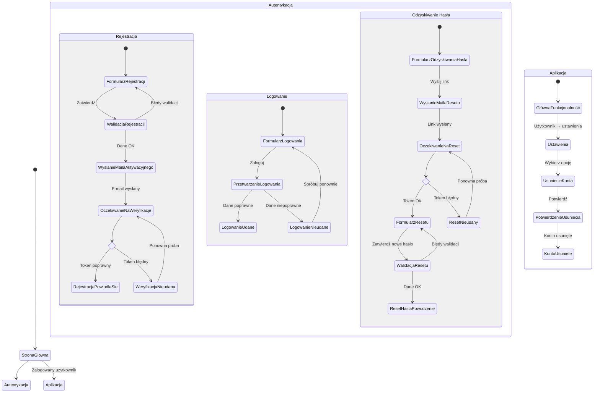

<mermaid_diagram>

```mermaid
stateDiagram-v2

[*] --> StronaGlowna
StronaGlowna --> Autentykacja
StronaGlowna --> Aplikacja: Zalogowany użytkownik

state "Autentykacja" as Auth {
  state "Rejestracja" as Rejestracja {
    [*] --> FormularzRejestracji
    FormularzRejestracji --> WalidacjaRejestracji: Zatwierdź
    WalidacjaRejestracji --> WyslanieMailaAktywacyjnego: Dane OK
    WalidacjaRejestracji --> FormularzRejestracji: Błędy walidacji
    WyslanieMailaAktywacyjnego --> OczekiwanieNaWeryfikacje: E-mail wysłany

    state if_Weryfikacja <<choice>>
    OczekiwanieNaWeryfikacje --> if_Weryfikacja
    if_Weryfikacja --> RejestracjaPowiodlaSie: Token poprawny
    if_Weryfikacja --> WeryfikacjaNieudana: Token błędny
    WeryfikacjaNieudana --> OczekiwanieNaWeryfikacje: Ponowna próba
  }

  state "Logowanie" as Logowanie {
    [*] --> FormularzLogowania
    FormularzLogowania --> PrzetwarzanieLogowania: Zaloguj
    PrzetwarzanieLogowania --> LogowanieUdane: Dane poprawne
    PrzetwarzanieLogowania --> LogowanieNieudane: Dane niepoprawne
    LogowanieNieudane --> FormularzLogowania: Spróbuj ponownie
  }

  state "Odzyskiwanie Hasła" as Reset {
    [*] --> FormularzOdzyskiwaniaHasla
    FormularzOdzyskiwaniaHasla --> WyslanieMailaResetu: Wyślij link
    WyslanieMailaResetu --> OczekiwanieNaReset: Link wysłany

    state if_ResetToken <<choice>>
    OczekiwanieNaReset --> if_ResetToken
    if_ResetToken --> FormularzResetu: Token OK
    if_ResetToken --> ResetNieudany: Token błędny
    ResetNieudany --> OczekiwanieNaReset: Ponowna próba

    FormularzResetu --> WalidacjaResetu: Zatwierdź nowe hasło
    WalidacjaResetu --> ResetHaslaPowodzenie: Dane OK
    WalidacjaResetu --> FormularzResetu: Błędy walidacji
  }
}

state "Aplikacja" as App {
  [*] --> GłównaFunkcjonalność
  GłównaFunkcjonalność --> Ustawienia: Użytkownik → ustawienia
  Ustawienia --> UsuniecieKonta: Wybierz opcję
  UsuniecieKonta --> PotwierdzenieUsuniecia: Potwierdź
  PotwierdzenieUsuniecia --> KontoUsuniete: Konto usunięte
}
```

</mermaid_diagram>
