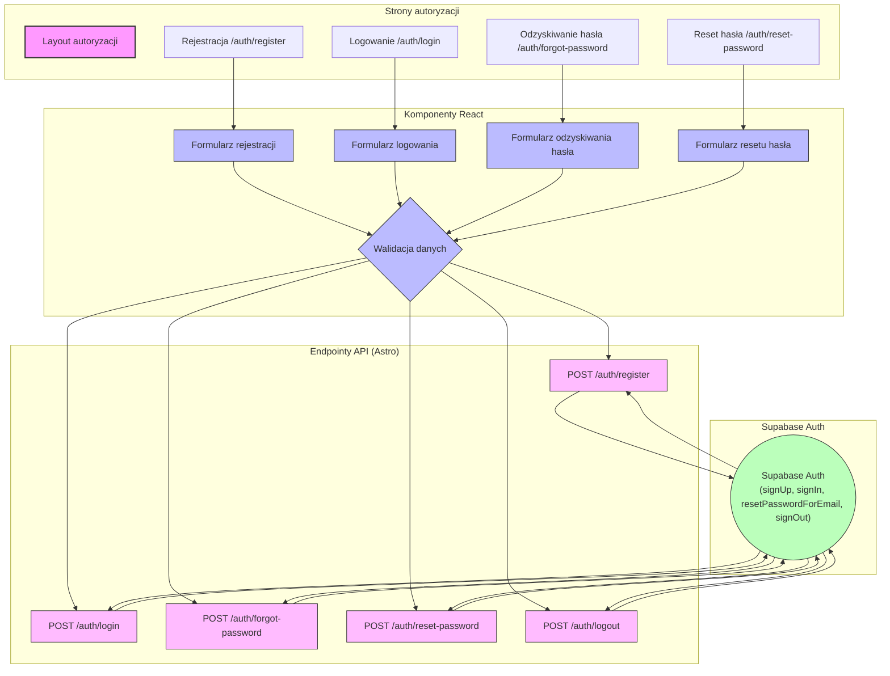

```mermaid
flowchart TD
  subgraph "Strony autoryzacji"
    AL["Layout autoryzacji"]
    RP["Rejestracja /auth/register"]
    LP["Logowanie /auth/login"]
    FP["Odzyskiwanie hasła /auth/forgot-password"]
    RSW["Reset hasła /auth/reset-password"]
  end

  subgraph "Komponenty React"
    RF["Formularz rejestracji"]
    LF["Formularz logowania"]
    FF["Formularz odzyskiwania hasła"]
    RPF["Formularz resetu hasła"]
    CV{"Walidacja danych"}
  end

  subgraph "Endpointy API (Astro)"
    RE["POST /auth/register"]
    LE["POST /auth/login"]
    FPE["POST /auth/forgot-password"]
    RSE["POST /auth/reset-password"]
    LO["POST /auth/logout"]
  end

  subgraph "Supabase Auth"
    SA(("Supabase Auth\n(signUp, signIn, resetPasswordForEmail, signOut)"))
  end

  RP --> RF
  LP --> LF
  FP --> FF
  RSW --> RPF

  RF --> CV
  LF --> CV
  FF --> CV
  RPF --> CV

  CV --> RE
  CV --> LE
  CV --> FPE
  CV --> RSE
  CV --> LO

  RE --> SA
  LE --> SA
  FPE --> SA
  RSE --> SA
  LO --> SA

  SA --> RE
  SA --> LE
  SA --> FPE
  SA --> RSE
  SA --> LO

  classDef layout fill:#f9f,stroke:#333,stroke-width:2px;
  classDef component fill:#bbf,stroke:#333,stroke-width:1px;
  classDef endpoint fill:#fbf,stroke:#333,stroke-width:1px;
  classDef service fill:#bfb,stroke:#333,stroke-width:1px;

  class AL layout;
  class RF,LF,FF,RPF,CV component;
  class RE,LE,FPE,RSE,LO endpoint;
  class SA service;
```
